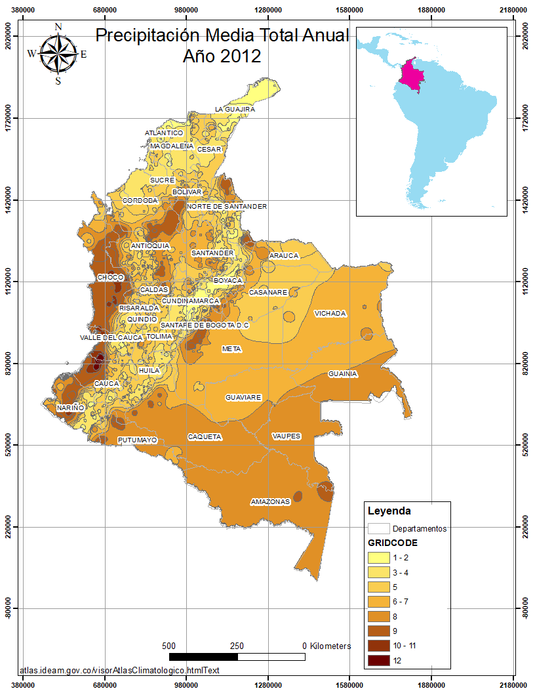
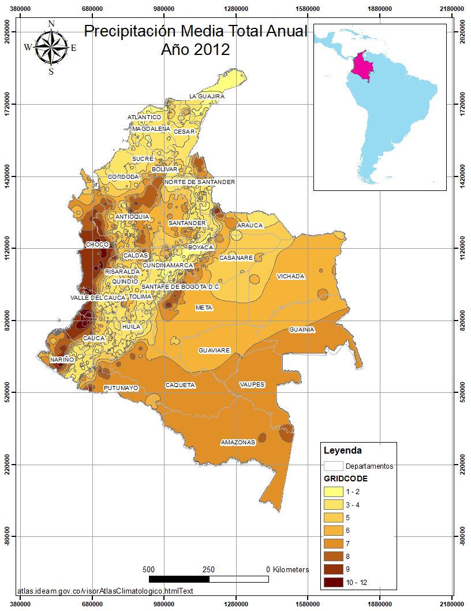

# Publicación de cartografía vía web
Repositorio colaborativo para curso de publicación de cartografía vía web, Especialización en Geomática. 
## Investigadores:
#### Lorena Rayo Rocha
#### Fernando Alcarcel Gutierrez
#### Albeiro López Pulido

# Precipitación media anual año 2012 Colombia

## 1. Cuál es el problema a tratar?

Para determinar el personal necesario por departamento disponible para atender amenazas por deslizamientos en el año 2012, se requiere conocer la cantidad de lluvias anuales en cada departamento, sectorizado por cantidad de lluvias anuales y tomar esta información como insumo para conocer cual departamento necesita más inversión al respecto. 

## 2. Por qué un mapa ayuda a resolverlo?

La visualizacion de datos espaciales permite determinar el efecto que el aumento de una variable tiene sobre una zona, en este caso, departamentos de Colombia. 

Se consulta un **mapa de precipitación total anual** con el cual se pretende observar la precipitación media anual por departamento en Colombia en el año 2012 y con esto predecir zonas suceptibles a desastres naturales resultado de un aumento en las lluvias de una zona particular.

 

Mapa precipitación media anual del año 2012 para Colombia resaltando sus departamentos.

## 3. Descripción del mapa temático (variable semleccionada, utilidad?

Se descargó la informacion de la pagina de [Sistema de información ambiental de Colombia](http://www.siac.gov.co/catalogo-de-mapas) con la cual se puede graficar los poligonos de precipitación media anual. Este mapa nos describe zonas con igual cantidad de precipitacion anual en Colombia en el año 2012, por tanto superponiendo con el mapa de departamentos de colombia podremos obtener los datos solicitados por los organismos de emergencia. 

## 4. Descripción de los métodos de clasificación seleccionados. Cuál es mejor para la variable seleccionada? por qué?

Se utilizaron dos metodos de clasificación: Natural Breaks y Quantile. De lo cual observamos que no hay mucha diferencia entre las visualizaciones de los dos casos. 

## 5. Listado de fuentes de datos seleccionados( proveedor, enlace para descarga, descripcón, procedimiento utilizado(plugins extensiones, procesos, transformaciones de datos, etc)

## 6.Ventajas/ desventajas/ dificultades/ diferencias encontradas al utilizar qgis y arcgis para el desarrollo del ejercicio.

